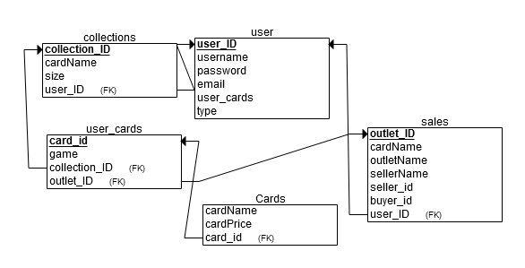

# Grinnell Final Proj.

## Narrative
This project will allow for multiple users to create collections of trading cards and keep them organized and easily accessible as well as allowing for selling of cards on a user to user basis.

All these operations will be carried out by a normal type of user and will all be organized by an administrator user.

The administrator user will be able to manage users as well as managing the types of collections
on the site. 

This project’s purpose is to allow users with multiple types of cards and collections an easy way to keep a running catalog of their collections, as well as to offer a place for users to expand their collection from like minded users.

Some assumptions made for this project were that user name cards and collections and such correctly as they are written on the card to allow for simple indexing, that all users are will and able to user the shop feature if they so desire regardless of age or other legal stipulations, and that the admins would have personal user accounts separate from their administrative accounts if they wanted to use the sites services.

## Structure

## Use Cases
### General users
- sign in with username and password 
  - create new account if none exists 
- manage account settings and information
- adding / removing cards from a users collection
- adding / removing new collections of cards
- using the shop to buy / sell cards 
### Administrative users
- managing user accounts
- manage who can and cant sell in the store
- manage database of all cards in system 
